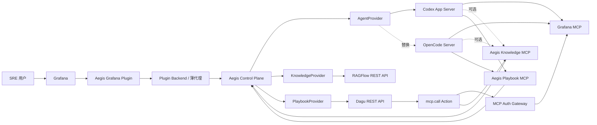

# Aegis SRE 目标架构

## 1. 架构目标

Aegis SRE 保留原产品的总体形态：用户在 Grafana 插件中完成告警分析、知识检索、Playbook 管理和 Agent 协作。变化发生在后端实现方式——通用能力由成熟开源组件负责，Aegis SRE 只维护产品领域和适配层。

核心原则：

1. **一个无状态产品控制面**：业务 API、授权收敛、协议归一化和 Provider 适配统一放在 Control Plane，不创建互相调用的小型自研服务群，也不预建产品影子数据库。
2. **Provider 拥有运行数据**：Agent 对话、RAG 索引、DAG 运行分别由 Codex/OpenCode、RAGFlow、Dagu 保存。
3. **公共契约不出现 Provider 类型**：前端不知道 RAGFlow Dataset ID、Dagu 文件路径或 Codex Thread ID。
4. **MCP 用于工具访问，REST 用于产品管理**：Agent 调工具走 MCP；插件 CRUD、分页、状态管理走 Control Plane REST。
5. **原生格式是事实来源**：Playbook 使用 Dagu YAML，不维护 Aegis 自有 DSL。
6. **默认只读，写操作显式升级**：Grafana 和 Dagu 的写能力使用独立凭据、白名单和审批路径。

## 2. 系统上下文



## 3. 组件边界

### 3.1 Grafana Plugin Frontend

负责：

- 页面布局、路由和交互状态。
- Workbench 流事件渲染。
- Knowledge 和 Playbook 的管理界面。
- 审批、人机输入、Artifact 和 Grafana 深链接展示。
- 通过 Gateway 调用稳定产品 API。

不负责：

- 直接连接 Codex/OpenCode、RAGFlow、Dagu 或 MCP Server。
- 保存 Provider 凭据。
- 判断可访问的 RAGFlow Dataset。
- 解释 Codex/OpenCode 私有事件结构。

### 3.2 Plugin Backend

作为薄代理，最多负责：

- 从 Grafana 请求上下文提取身份和组织信息。
- 将请求转发给 Control Plane。
- 对流式响应进行透明代理。
- 隐藏 Control Plane 地址和服务凭据。

它不应包含 Agent 编排、知识检索策略或 Playbook 运行逻辑。

### 3.3 Aegis Control Plane

采用模块化单体，负责：

- 对前端提供稳定 REST/SSE API。
- 基于 Grafana Actor Context 收敛 Folder、权限和资源范围。
- 将 Provider 资源适配为稳定、Provider-neutral 的公共契约。
- Agent、Knowledge、Playbook Provider 适配。
- 工具策略、审批路由、幂等语义适配、trace 传播和受控错误。
- 暴露 Aegis 产品领域 MCP。
- 按 ADR 0007 保存 Query-backed Chart Definition 和 Canvas 布局投影。

Control Plane 默认不复制 Provider 数据，也不维护 Provider 状态的影子表或摘要索引。唯一首版例外是
ADR 0007 明确归 Aegis 所有的 Canvas 产品投影，它使用最小 SQLite 保存查询定义和布局，不保存 Agent
会话或 Grafana 查询结果。公共资源标识优先使用调用方生成 ID、Provider 原生 metadata/tag 或确定性
命名；若仍无法避免暴露 Provider 内部 ID，必须在对应垂直切片中提交 ADR 后再决定最小方案。

`Session`、`Turn`、`Message` 和统一事件只是 Aegis 对前端提供的防腐层命令、查询投影与
流式协议，不是要求 Control Plane 保存的领域实体。冻结公共契约只保证前端不感知
Codex/OpenCode 私有协议，不改变 Agent Provider 对会话数据的所有权。

### 3.4 Agent Provider

领域接口以“会话、回合、事件、审批”为单位：

```go
type AgentProvider interface {
    ListSessions(ctx context.Context, page PageRequest) (Page[Session], error)
    CreateSession(ctx context.Context, input CreateSessionInput) (SessionRef, error)
    ReadSession(ctx context.Context, ref SessionRef) (SessionDetail, error)
    RenameSession(ctx context.Context, ref SessionRef, title string) error
    ArchiveSession(ctx context.Context, ref SessionRef) error
    UnarchiveSession(ctx context.Context, ref SessionRef) error
    StartTurn(ctx context.Context, ref SessionRef, input TurnInput) (EventStream, error)
    CancelTurn(ctx context.Context, ref SessionRef, turnID string) error
    ResolveApproval(ctx context.Context, input ApprovalDecision) (EventStream, error)
    DeleteSession(ctx context.Context, ref SessionRef) error
}
```

Codex Adapter 使用 App Server 的 Thread/Turn/Item 和双向 JSON-RPC；OpenCode Adapter 使用 Session/Message、HTTP 和 SSE。两套协议只能存在于 adapter 内部。

上述 list/read/create/rename/archive/delete 必须直接委托对应 Provider 的原生会话能力。
Codex 的 `thread/list`、`thread/read`、`thread/resume`、`thread/name/set`、
`thread/archive` 和 `thread/delete` 以及 OpenCode 的 Session API 是会话事实来源；
Control Plane 不增加 `SessionRepository`、消息表、事件表、Checkpoint 或前端整会话保存接口。
`thread/resume` 等加载动作属于 Adapter 为继续 Turn 执行的内部细节，不代表 Aegis 接管会话状态。

统一事件：

```text
message.delta
tool.started
tool.completed
approval.requested
approval.resolved
artifact.created
turn.completed
turn.failed
```

Control Plane 通过 Agent Provider 直接 list/read/resume/archive/delete 会话，不保存产品 Session、Provider Session ID、当前回合状态或 Checkpoint。公共 ID 只做无状态引用转换；幂等只适配 Provider 已验证的原生能力。若 Provider 不支持调用方生成 Turn ID 或幂等键，Control Plane 不得通过内存去重或自建持久化伪造保证，而应禁止不安全的自动重试并明确暴露限制。

首个版本按部署选择单一 `AGENT_PROVIDER=codex|opencode`，不在同一 Control Plane
实例内为每个 Session 动态选择 Provider。切换 Provider 使用新的部署配置和会话空间；
若以后需要并存，必须先证明 Provider 原生 metadata 或自包含公开引用足以完成无状态路由，
否则另行提交 ADR，不预建 Session/Provider 映射表。

多用户环境还必须先解决 Provider 原生会话命名空间隔离：优先按可信 Actor 范围隔离
Provider 运行实例、数据目录或 Provider 原生租户空间。不得让共享 App Server 的
`thread/list` 把其他 Actor 的会话暴露出来，也不得为弥补共享命名空间而建立 Aegis 影子会话表。
`FolderUID` 默认是请求时的授权上下文；只有 Provider 原生支持可靠保存和查询时，才能成为
Session 的持久属性。

首个可运行版本按 ADR 0003 只允许配置的单一 Tenant、Org 和 User 使用 Agent Provider；其余
Actor fail-closed。该限制用于在不建立影子表的前提下形成真实会话闭环。多用户 private Session
需要 Provider 原生租户空间或按 Actor 确定性隔离的进程与数据目录，并在新的 ADR 与恢复验收后
才能启用。

### 3.5 Knowledge Provider 与 Knowledge MCP

Knowledge/RAGFlow 代码保留，但默认通过 `AEGIS_KNOWLEDGE_ENABLED=false` fail-closed；未显式
启用时不装配 RAGFlow Provider、不注册 Knowledge MCP，也不启动任何 RAGFlow 组件。Knowledge
只在独立的可选部署叠加文件中启用，不能成为 Agent 或 Playbook 的启动依赖。

RAGFlow REST API 负责管理面：

- Dataset CRUD。
- 文档上传、解析、停止和删除。
- 文档与 Chunk 浏览。
- 混合检索和引用。

Aegis Knowledge MCP 负责 Agent 工具面：

```text
knowledge.search
knowledge.get_document
knowledge.list_sources
```

Agent 传公共资源 ID、Service 或当前 Folder 上下文。Control Plane 完成范围收敛后，由 Knowledge Adapter 使用 RAGFlow 原生资源和 metadata 查询；Provider 内部 ID 不进入前端契约。RAGFlow 原生 MCP 可作为单租户开发调试工具，但不作为正式授权入口。

阶段 8 按 ADR 0004 使用确定性公共标识而不建立映射表：KnowledgeBase ID 由 Actor 范围、
Folder UID 和幂等键派生，Document ID 由 KnowledgeBase ID 和幂等键派生。RAGFlow Dataset
使用确定性名称，Document 的公共 ID、原始文件名、Service、标签和内容摘要保存在原生
`meta_fields`。公共 ID 只用于定位，不是授权凭据；每次操作都重新校验可信 Actor 与 Folder 范围。

Knowledge 所需的最小 Folder 授权从阶段 10 前置到阶段 8。Plugin Backend 丢弃浏览器提供的身份和
Folder 转发头，使用 Grafana 后端身份校验 `folders:uid:<uid>` 权限后再注入可信上下文。Control
Plane 对缺少或越界的 Folder 默认拒绝。当前单用户 MCP Token 在服务端绑定固定 Actor 与显式
Folder allowlist；模型不能自行声明身份或扩大范围。多用户委托身份仍需单独 ADR。

### 3.6 Dagu 与双向 MCP

Dagu 是 Playbook 定义和运行的唯一事实来源：

- 原生 YAML、参数 Schema 和校验。
- 调度、并发、重试、人工任务和审批。
- Run、Step 状态、日志和 Artifact。

固定 Dagu `2.13.0` 没有供 Agent 直接使用的原生 MCP Server。Aegis 通过 Control Plane 的
`/mcp/playbooks` 提供薄 facade，把 `playbook.list`、`playbook.validate`、`playbook.start` 和
`playbook.get_run` 映射到 `PlaybookProvider`；它不实现调度、重试或 YAML DSL。插件的完整
Run 运维操作继续使用 Control Plane REST/SSE。

`mcp.call` Action 服务于 `Dagu → 外部 MCP`，让工作流中的节点调用允许的 Grafana 工具。它必须有 Server 白名单、Tool 白名单、超时、结果大小限制、TLS 配置和 Artifact 归档，并禁止调用 Dagu 自身或 `/mcp/playbooks` 形成递归运行。

Dagu REST API 必须启用独立服务凭据。Control Plane 从只读挂载的凭据文件读取并在每次请求时重新加载，避免凭据进入镜像、命令行或前端契约。

### 3.7 Grafana MCP

至少部署两个逻辑实例：

| 实例 | 权限 | 调用方 |
| --- | --- | --- |
| `grafana-read` | `--disable-write`，按类别启用只读工具 | 默认 Agent、只读 Playbook |
| `grafana-write` | 独立凭据和极小工具白名单 | 获批 Agent、受控 Dagu Workflow |

初期可使用固定 Service Account，但接口从第一天携带 Actor Context，避免把单组织假设写死。

官方 Grafana MCP v1.0.0 不负责校验入站 MCP 调用方身份，因此 Aegis 在它前面部署一个必要的薄鉴权网关。网关只校验独立调用方 Bearer Token、清理可伪造的转发头并代理 `/mcp`，不实现或改写任何 Grafana 工具。Grafana MCP 使用另一个 Viewer Service Account Token 访问 Grafana；两个凭据必须分离并支持文件轮换。

## 4. 数据归属

| 数据 | 唯一事实来源 | Control Plane 行为 |
| --- | --- | --- |
| Grafana Folder、Dashboard、告警、标签和权限 | Grafana | 按 Actor Context 查询和收敛，不复制 |
| Agent Session、Turn、消息、工具调用和 Agent Approval | Codex/OpenCode | 直接 list/read/resume/archive/delete 与流转，不保存映射、状态、消息或事件历史 |
| KnowledgeBase/Dataset、Document、解析状态、Chunk、Embedding 和索引 | RAGFlow | 直接适配与授权收敛，不建立影子资源 |
| Playbook YAML、Run、Step、Human Task、Approval、日志和 Artifact | Dagu | 直接适配，不保存映射或摘要索引 |
| Query-backed Chart Definition 与 Canvas 布局 | Aegis Canvas SQLite | 保存产品投影；按公开 Session ID + Actor scope 关联，不保存 Session 或查询样本 |
| request/trace ID | 请求上下文与可观测性后端 | 传播并写结构化日志，不作为业务记录保存 |
| 幂等状态 | 对应 Provider；Canvas 发布归 Aegis | Provider 操作适配原生能力；Canvas SQLite 保存发布 key 和请求摘要 |

## 5. 持久化决策门

Aegis Control Plane 只按 ADR 0007 为 Canvas 部署最小 SQLite；该数据库不是通用资源库。接入每个
Provider 或新增其他持久化前仍必须验证：

- 是否支持调用方生成资源 ID 或幂等键。
- 是否支持 metadata、tag、名称或其他可查询的外部引用。
- 是否能从 Provider 恢复列表、详情、审批和运行历史。
- 是否能在不向浏览器暴露 Provider 类型、内部 ID 或凭据的前提下形成公共资源引用。

只有出现经过真实契约测试证明、且无法由 Grafana 或对应 Provider 承载的产品自有状态时，才能通过
ADR 引入最小持久化。Canvas 已通过 ADR 0007 完成该决策；其 SQLite 不得扩展为跨 Provider 的通用
映射数据库。后续 ADR 仍必须说明事实来源、数据生命周期、备份恢复、迁移和删除策略。

## 6. 对外 API 草案

```text
/api/v1/sessions
/api/v1/sessions/{id}/turns:stream
/api/v1/sessions/{id}/approvals/{approvalId}:resolve
/api/v1/sessions/{id}/canvas

/api/v1/services
/api/v1/knowledge-bases
/api/v1/knowledge-bases/{id}/documents
/api/v1/documents/{id}/index
/api/v1/knowledge:search

/api/v1/playbooks
/api/v1/playbooks/{id}/validate
/api/v1/playbooks/{id}/runs
/api/v1/runs/{id}
/api/v1/runs/{id}/events
/api/v1/runs/{id}/human-tasks/{stepId}:complete
/api/v1/runs/{id}/approvals/{stepId}:resolve
```

流事件使用统一 envelope：

```json
{
  "event_id": "evt_...",
  "event_type": "tool.completed",
  "session_id": "ses_...",
  "turn_id": "turn_...",
  "sequence": 42,
  "occurred_at": "2026-08-13T12:00:00Z",
  "payload": {}
}
```

`event_id + sequence` 用于一次流连接内的排序和客户端去重；Provider 原始事件只用于内部诊断，
不直接透传。浏览器或 Control Plane 断线后，优先重新连接 Provider，并通过 Provider 已持久化的
Thread/Turn/Item 重建最终会话视图。若 Provider 不能重放断线期间的精确增量事件，应明确终止
旧流并重新读取会话快照，不得为精确重放增加 Aegis 事件存储。

## 7. 部署拓扑

开发环境优先使用 Compose，生产环境再提供 Helm：

```text
Grafana + Aegis Plugin
Aegis Control Plane
Aegis Canvas SQLite（Control Plane 单实例本地持久卷）
Codex App Server 或 OpenCode Server
RAGFlow 及其官方依赖
Dagu Server / Scheduler / Worker
Grafana MCP Read
Grafana MCP Write（按需）
Aegis MCP Auth Gateway
Aegis mcp.call Runner
```

Agent Provider 的数据目录或官方持久卷必须独立挂载并进入对应 Provider 的备份恢复流程。
这是对成熟组件状态的部署管理，不是由 Aegis 复制 Session/Turn 数据。Codex App Server
进程监管也只负责启动、健康检查、重连和退出，不实现会话存储或 Agent 编排。

Canvas SQLite 使用与 Agent Provider 分离的 `/var/lib/aegis/canvas` 持久卷。首版 Control Plane
只能运行一个副本，SQLite 文件不得放在共享网络文件系统；备份和恢复按 ADR 0007 执行。

仓库根 `compose.yaml` 提供最小可复现链路。Grafana 和 Dagu 只绑定 loopback；Control Plane、Grafana MCP 和 MCP 鉴权网关不发布主机端口；MCP 网络为内部网络。一次性 Grafana Bootstrap 使用本地管理员凭据创建 Viewer Service Account，将 Token 写入共享卷后退出，它是部署初始化任务而不是新的产品服务。

Control Plane 的 `/health/ready` 会实际探测已配置的 Dagu，而不是只检查环境变量；能力发现也只在探测成功时报告 Playbook 可用。未配置的可选 Provider 不阻止进程启动，已配置但不可达的依赖会使 readiness 失败。

所有 Provider 版本都必须固定，升级通过契约测试和端到端用例后才能合并。不要使用 `latest` 作为可发布环境的镜像标签。生产环境仍需在入口补齐 TLS、Secret Manager 和 NetworkPolicy；本地 Compose 的 loopback 与内部网络不能替代这些生产控制。

## 8. 暂缓但必须预留的安全边界

```go
type ActorContext struct {
    TenantID  string
    OrgID     string
    UserID    string
    FolderUID string
    Roles     []string
}
```

第一阶段允许开发环境填入固定 Actor，但所有 Application Service 和 Provider 调用都应显式接收它。后续接入 Grafana 身份时无需重写领域接口。

## 9. 主要上游资料

- [Codex App Server](https://learn.chatgpt.com/docs/app-server)
- [OpenCode Server](https://opencode.ai/docs/server/)
- [OpenCode MCP Servers](https://opencode.ai/docs/mcp-servers/)
- [RAGFlow MCP Server](https://ragflow.io/docs/launch_mcp_server)
- [RAGFlow MCP Tools](https://ragflow.io/docs/mcp_tools)
- [Dagu](https://github.com/dagucloud/dagu)
- [Grafana MCP Server](https://github.com/grafana/mcp-grafana)
