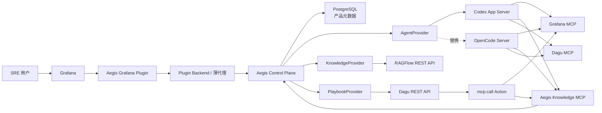

# Aegis SRE 目标架构

## 1. 架构目标

Aegis SRE 保留原产品的总体形态：用户在 Grafana 插件中完成告警分析、知识检索、Playbook 管理和 Agent 协作。变化发生在后端实现方式——通用能力由成熟开源组件负责，Aegis SRE 只维护产品领域和适配层。

核心原则：

1. **一个产品控制面**：业务 API、稳定 ID、跨模块关系和审计关联统一放在 Control Plane，不创建互相调用的小型自研服务群。
2. **Provider 拥有运行数据**：Agent 对话、RAG 索引、DAG 运行分别由 Codex/OpenCode、RAGFlow、Dagu 保存。
3. **公共契约不出现 Provider 类型**：前端不知道 RAGFlow Dataset ID、Dagu 文件路径或 Codex Thread ID。
4. **MCP 用于工具访问，REST 用于产品管理**：Agent 调工具走 MCP；插件 CRUD、分页、状态管理走 Control Plane REST。
5. **原生格式是事实来源**：Playbook 使用 Dagu YAML，不维护 Aegis 自有 DSL。
6. **默认只读，写操作显式升级**：Grafana 和 Dagu 的写能力使用独立凭据、白名单和审批路径。

## 2. 系统上下文



## 3. 组件边界

### 3.1 Grafana Plugin Frontend

负责：

- 页面布局、路由和交互状态。
- Workbench 流事件渲染。
- Knowledge 和 Playbook 的管理界面。
- 审批、人机输入、Artifact 和 Grafana 深链接展示。
- 通过 Gateway 调用稳定产品 API。

不负责：

- 直接连接 Codex/OpenCode、RAGFlow、Dagu 或 MCP Server。
- 保存 Provider 凭据。
- 判断可访问的 RAGFlow Dataset。
- 解释 Codex/OpenCode 私有事件结构。

### 3.2 Plugin Backend

当前阶段只作为待定薄层，不在第一轮实现中扩展。最终最多负责：

- 从 Grafana 请求上下文提取身份和组织信息。
- 将请求转发给 Control Plane。
- 对流式响应进行透明代理。
- 隐藏 Control Plane 地址和服务凭据。

它不应包含 Agent 编排、知识检索策略或 Playbook 运行逻辑。

### 3.3 Aegis Control Plane

采用模块化单体，负责：

- 对前端提供稳定 REST/SSE API。
- ServiceEntry、Grafana Folder UID、标签和业务关联。
- 公共 ID 到 Provider ID 的映射。
- Agent、Knowledge、Playbook Provider 适配。
- 工具策略、审批关联、幂等控制和受控错误。
- 暴露 Aegis 产品领域 MCP。

控制面不复制 Provider 的完整运行数据。

### 3.4 Agent Provider

领域接口以“会话、回合、事件、审批”为单位：

```go
type AgentProvider interface {
    CreateSession(ctx context.Context, input CreateSessionInput) (SessionRef, error)
    LoadSession(ctx context.Context, ref SessionRef) (Session, error)
    StartTurn(ctx context.Context, ref SessionRef, input TurnInput) (EventStream, error)
    CancelTurn(ctx context.Context, ref SessionRef, turnID string) error
    ResolveApproval(ctx context.Context, input ApprovalDecision) (EventStream, error)
    DeleteSession(ctx context.Context, ref SessionRef) error
}
```

Codex Adapter 使用 App Server 的 Thread/Turn/Item 和双向 JSON-RPC；OpenCode Adapter 使用 Session/Message、HTTP 和 SSE。两套协议只能存在于 adapter 内部。

统一事件：

```text
message.delta
tool.started
tool.completed
approval.requested
approval.resolved
artifact.created
turn.completed
turn.failed
```

Control Plane 只存产品 Session、Provider 名称、Provider Session ID、当前回合状态和幂等键，不复制完整对话或 Provider Checkpoint。

### 3.5 Knowledge Provider 与 Knowledge MCP

RAGFlow REST API 负责管理面：

- Dataset CRUD。
- 文档上传、解析、停止和删除。
- 文档与 Chunk 浏览。
- 混合检索和引用。

Aegis Knowledge MCP 负责 Agent 工具面：

```text
knowledge.search
knowledge.get_document
knowledge.list_sources
```

Agent 传业务 `knowledge_base_id`、`service_id` 或当前 Folder 上下文。Control Plane 完成范围收敛后才把 Provider Dataset ID 交给 RAGFlow。RAGFlow 原生 MCP 可作为单租户开发调试工具，但不作为正式授权入口。

### 3.6 Dagu 与双向 MCP

Dagu 是 Playbook 定义和运行的唯一事实来源：

- 原生 YAML、参数 Schema 和校验。
- 调度、并发、重试、人工任务和审批。
- Run、Step 状态、日志和 Artifact。

Dagu 内置 MCP 服务于 `Agent → Dagu`，让 Agent 读取、修改和执行工作流。

`mcp.call` Action 服务于 `Dagu → 外部 MCP`，让工作流中的节点调用允许的 Grafana 或 Knowledge 工具。它必须有 Server 白名单、Tool 白名单、超时、结果大小限制、TLS 配置和 Artifact 归档，并禁止调用 Dagu 自身的执行工具形成递归运行。

### 3.7 Grafana MCP

至少部署两个逻辑实例：

| 实例 | 权限 | 调用方 |
| --- | --- | --- |
| `grafana-read` | `--disable-write`，按类别启用只读工具 | 默认 Agent、只读 Playbook |
| `grafana-write` | 独立凭据和极小工具白名单 | 获批 Agent、受控 Dagu Workflow |

初期可使用固定 Service Account，但接口从第一天携带 Actor Context，避免把单组织假设写死。

## 4. 数据归属

| 数据 | 事实来源 | Control Plane 是否保存 |
| --- | --- | --- |
| ServiceEntry、Folder UID、标签、服务关联 | PostgreSQL | 完整保存 |
| 业务 KnowledgeBase、Document ID | PostgreSQL | 保存业务字段与映射 |
| 原文件、解析状态、Chunk、Embedding、索引 | RAGFlow | 不复制 |
| Playbook YAML、运行、Step、日志、Artifact | Dagu | 只保存业务映射和摘要索引 |
| Agent 对话、工具调用详细历史 | Codex/OpenCode | 只保存映射和状态 |
| 审批关联、幂等键、跨 Provider trace ID | PostgreSQL | 保存 |

## 5. 建议的持久化模型

首批表：

```text
services
knowledge_bases
knowledge_documents
provider_collections
provider_documents
agent_sessions
playbook_refs
playbook_run_refs
approval_refs
operation_idempotency
```

每张映射表同时保存 `provider`、`provider_id`、创建时间和最后同步版本。Provider ID 不返回给普通前端接口。

## 6. 对外 API 草案

```text
/api/v1/sessions
/api/v1/sessions/{id}/turns:stream
/api/v1/sessions/{id}/approvals/{approvalId}:resolve

/api/v1/services
/api/v1/knowledge-bases
/api/v1/knowledge-bases/{id}/documents
/api/v1/documents/{id}/index
/api/v1/knowledge:search

/api/v1/playbooks
/api/v1/playbooks/{id}/validate
/api/v1/playbooks/{id}/runs
/api/v1/runs/{id}
/api/v1/runs/{id}/events
/api/v1/runs/{id}/human-tasks/{stepId}:complete
/api/v1/runs/{id}/approvals/{stepId}:resolve
```

流事件使用统一 envelope：

```json
{
  "event_id": "evt_...",
  "event_type": "tool.completed",
  "session_id": "ses_...",
  "turn_id": "turn_...",
  "sequence": 42,
  "occurred_at": "2026-08-13T12:00:00Z",
  "payload": {}
}
```

`event_id + sequence` 用于断线重连和去重；Provider 原始事件只用于内部诊断，不直接透传。

## 7. 部署拓扑

开发环境优先使用 Compose，生产环境再提供 Helm：

```text
Grafana + Aegis Plugin
Aegis Control Plane
PostgreSQL
Codex App Server 或 OpenCode Server
RAGFlow 及其官方依赖
Dagu Server / Scheduler / Worker
Grafana MCP Read
Grafana MCP Write（按需）
Aegis mcp.call Runner
```

所有 Provider 版本都必须固定，升级通过契约测试和端到端用例后才能合并。不要使用 `latest` 作为可发布环境的镜像标签。

## 8. 暂缓但必须预留的安全边界

```go
type ActorContext struct {
    TenantID  string
    OrgID     string
    UserID    string
    FolderUID string
    Roles     []string
}
```

第一阶段允许开发环境填入固定 Actor，但所有 Application Service 和 Provider 调用都应显式接收它。后续接入 Grafana 身份时无需重写领域接口。

## 9. 主要上游资料

- [Codex App Server](https://learn.chatgpt.com/docs/app-server)
- [OpenCode Server](https://opencode.ai/docs/server/)
- [OpenCode MCP Servers](https://opencode.ai/docs/mcp-servers/)
- [RAGFlow MCP Server](https://ragflow.io/docs/launch_mcp_server)
- [RAGFlow MCP Tools](https://ragflow.io/docs/mcp_tools)
- [Dagu](https://github.com/dagucloud/dagu)
- [Grafana MCP Server](https://github.com/grafana/mcp-grafana)
