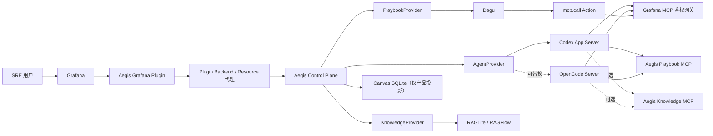

# Aegis SRE 基本架构

本文是 Aegis SRE 的稳定架构基线，描述当前代码已经形成的职责边界、数据归属和主要调用链。
它不是迭代计划，也不记录某个 Provider 的每个接口细节。实现新能力、替换外部组件或增加持久化
之前，先确认是否仍符合本文；如果不能符合，应先补充 ADR。

## 1. 当前范围

当前产品入口是 Grafana App Plugin。已经形成真实运行闭环的主要路径是：

- Workbench 会话：会话列表、创建/打开/重命名/归档/删除、Agent 回合流式输出、审批和 Canvas。
- Playbook：原生 Dagu YAML 的列表、校验、创建、编辑、删除、运行、运行事件、人工任务、审批和 Artifact。
- Agent：通过 Codex App Server 或 OpenCode Server 接入；当前部署默认使用 OpenCode，Codex 是可替换实现。
- Knowledge 后端：`KnowledgeProvider`、RAGLite 默认适配、RAGFlow 迁移期适配、REST 管理接口和受限 Knowledge MCP 已具备，按可选能力部署。
- Grafana MCP：官方只读 MCP Server、独立调用方鉴权网关和 Dagu `mcp.call` 出站调用链已部署。

当前插件主链路是 Workbench 会话和 Playbook；Knowledge 的后端能力已经具备，但不把它描述为与这两条
页面同等完成的前端产品闭环。插件中还保留部分 fixture/未接通页面。真实运行模式对未配置的能力返回
明确的不可用错误，不静默回退到 fixture 或 mock 数据。

Skill、Alerts 和 Audit 尚未接通真实 Provider；接入时的归属、授权矩阵和门禁见
[Skill、Alerts 与 Audit 权限接入设计](deferred-module-authorization.md)，不得以现有 fixture 固化生产事实来源。

## 2. 架构原则

1. **控制面优先**：Aegis 只实现产品 API、授权收敛、协议归一化和必要适配，不重新实现 Agent、RAG、Workflow 或 Grafana MCP 的通用能力。
2. **模块化单体**：一个 Control Plane 进程承载 HTTP API、Application service、ports 和 adapters；不因每个 Provider 再拆自研服务。
3. **Provider 持有运行数据**：Agent 会话、Knowledge 索引、Dagu Playbook/Run 分别由对应 Provider 持久化，Control Plane 不建立影子资源库。
4. **稳定公共契约**：前端和领域模型只使用 `internal/ports`、`internal/domain` 与 `api/openapi.yaml` 定义的 Provider-neutral 类型；Provider 类型、SDK 类型、内部路径和协议只存在于 adapter。
5. **原生格式为事实来源**：Playbook 的唯一事实来源是 Dagu YAML，不维护第二套 DSL、规范化 YAML 副本或图模型写回逻辑。
6. **REST 与 MCP 分工**：插件管理和运维操作走 Control Plane REST/SSE；Agent 调用工具走 MCP；Agent 不直接访问 Dagu、Knowledge Provider 或 Grafana MCP。
7. **默认 fail-closed**：凭据、Actor、Folder 范围、Provider 健康检查或白名单不满足时拒绝请求，不用内存状态伪造持久化和幂等保证。

## 3. 系统上下文

图中虚线表示可选或可替换能力。Grafana MCP 网关只负责调用方 Bearer Token、Host/Origin 和代理，
不复制或改写 Grafana 工具；Playbook/Knowledge MCP 只做 Control Plane port 的薄 facade。

## 4. 代码分层与职责

### 4.1 Grafana Plugin

位置：`grafana-plugin/src/`。

插件负责路由、页面、交互状态和 Provider-neutral 视图模型。Workbench 通过
`resourceWorkbenchGateway` 调用会话/Canvas API 并消费 SSE；Playbook 页面通过
`resourcePlaybookCrudGateway` 调用 YAML、Run、事件和 Artifact API。Knowledge 相关前端代码如启用，
也必须通过独立的 management gateway 和 Folder UID 请求头访问后端，但它不改变当前两条主链路的完成范围。

插件不直接连接 Agent、Dagu、RAG Provider 或 MCP，也不保存这些组件的凭据。`AppServicesProvider`
统一选择 real/fixture 模式；只有显式 fixture 模式才能使用内存 fixture。

### 4.2 Plugin Backend

Plugin Backend 是 Grafana Resource API 下的薄代理：

- 从 Grafana 请求上下文取得可信身份和组织信息；
- 向 Control Plane 转发 REST/SSE，并隐藏服务地址与服务凭据；
- 对流式响应保持透明，传递请求/trace 关联信息。

它不实现 Agent 编排、知识检索策略、Dagu 状态机或业务持久化。浏览器提交的身份和 Folder 不能直接
成为授权依据，必须由服务端校验后再转发。

### 4.3 Control Plane

入口：`cmd/control-plane/`；HTTP 与配置：`internal/platform/`；应用服务：`internal/application/`；
领域类型：`internal/domain/`；稳定接缝：`internal/ports/`；外部协议：`internal/adapters/`。

Control Plane 是无状态业务控制面，负责：

- 暴露 `api/openapi.yaml` 对应的 v1 REST/SSE 契约和 `/health/*`；
- 将 Actor、Folder、权限和服务端凭据收敛到每次 Provider 调用；
- 通过 `AgentProvider`、`KnowledgeProvider`、`PlaybookProvider` 屏蔽外部协议差异；
- 暴露 `/mcp/playbooks`、可选 `/mcp/knowledge` 和 `/mcp/canvas`；
- 统一错误、分页、事件 envelope、幂等键、If-Match/revision 和 trace 传播。

除 Canvas 外，Control Plane 不保存 Session、Message、Turn、Knowledge 文档/Chunk、Playbook YAML、
Run 状态或 Artifact 的副本。

### 4.4 Ports 与 Adapters

`internal/ports` 是架构中最重要的稳定边界：

| Port | 当前 Adapter | 事实来源 | 主要职责 |
| --- | --- | --- | --- |
| `AgentProvider` | `internal/adapters/codex`、`opencode`，外加 `agentscope` | Codex/OpenCode | 会话、回合、消息、审批和事件流 |
| `PlaybookProvider` | `internal/adapters/dagu` | Dagu | YAML、校验、运行、步骤、审批、日志和 Artifact |
| `KnowledgeProvider` | `raglite`、`ragflow`，由 `knowledgefactory` 选择 | 当前 Knowledge Provider | Collection、文档、解析/索引、Chunk 和检索 |
| `CanvasStore` | `internal/adapters/canvassqlite` | Aegis | Query-backed Chart 与 Canvas 布局投影 |

Provider 的 SDK 类型、HTTP 路径、认证方式和错误映射必须留在对应 adapter。替换 Provider 时，优先
替换 adapter 和契约测试，不改动前端公共模型。

## 5. 三条主要调用链

### 5.1 会话与 Agent 工具调用

1. 插件通过 Resource API 请求 `/api/v1/sessions` 或 `/api/v1/sessions/{id}`。
2. Control Plane 将公开 Session ID 转换为当前 Agent Provider 可用的引用，并重新校验 Actor scope。
3. `POST /sessions/{id}/turns:stream` 启动回合；adapter 把 Codex JSON-RPC 或 OpenCode HTTP/SSE 事件归一化为统一事件。
4. Agent 在自己的运行时中通过 MCP 访问 Grafana、Playbook，以及按部署启用的 Knowledge/Canvas 工具。
5. 插件只消费统一事件（文本增量、工具开始/结束、审批、Artifact、回合完成/失败），断线后重新读取 Provider 会话或结束旧流，不由 Aegis 事件表重放。

会话数据、消息历史和 Provider 原生审批归 Agent Provider 所有。公开 ID 只是无状态引用转换；Codex
使用部署密钥进行确定性编码，OpenCode 使用调用方生成的公开 ID，具体决策见
[ADR 0002](adr/0002-agent-public-identifiers.md)。

### 5.2 Playbook 管理与运行

1. 插件提交原生 `application/yaml`；Control Plane 只做边界校验并调用 `PlaybookProvider`。
2. Dagu 保存 YAML、执行调度、重试、人工任务、审批、Run、日志和 Artifact。
3. 插件通过 REST/SSE 读取 Run 状态、事件和 Artifact；取消、重试、人工任务和审批不会在 Control Plane 复制状态机。
4. Agent 通过 `/mcp/playbooks` 使用 `list`、`validate`、`start`、`get_run` 等最小工具集；该 facade 不实现调度或 YAML DSL。
5. Dagu 内的 `mcp.call` 只允许调用配置白名单中的外部 MCP（当前主要是 Grafana MCP），禁止递归调用 Playbook MCP。

Playbook UI 管理的 `pbk_` 命名空间和 GitOps DAG 分离，同一个 DAG 不允许隐式双写，详见
[ADR 0001](adr/0001-dagu-authoring-ownership.md) 与 [ADR 0005](adr/0005-agent-playbook-mcp-boundary.md)。

### 5.3 Knowledge 管理与检索

1. 插件在 Grafana Folder 上下文中调用 Knowledge REST API；Control Plane 重新验证 Folder 权限和 Actor scope。
2. `knowledgefactory` 按部署配置选择单一 RAGLite 或 RAGFlow adapter，不在 Collection/Document 层动态混用。
3. Provider 持有 Collection、文档原文、解析任务、Chunk、Embedding 和索引；Control Plane 只做管理投影和授权收敛。
4. Agent 使用可选 `/mcp/knowledge` 的 `knowledge.search`、`get_document`、`list_sources`，不能直接调用 Provider 原生 MCP。
5. Knowledge 未配置时不注册 endpoint，也不阻止基础 Agent + Playbook 栈启动；已配置但不可达时 readiness 明确失败。

Knowledge 公共 ID 由 Actor/Folder 范围和幂等键确定性生成，Provider 内部 ID 不进入前端契约。Folder
授权和身份边界见 [ADR 0004](adr/0004-knowledge-identity-and-folder-authorization.md)。legacy v1 Collection
只允许原创建者读取；Folder Admin 通过 Provider 原生 metadata/scope 迁移升级到 v2，不下载或重传文档，
也不建立迁移映射表。

## 6. Canvas 与二进制 Artifact

Canvas 是 Aegis 唯一明确拥有的产品状态：SQLite 只保存 Query Definition、Chart Definition、布局、
顺序、可见性和 revision，不保存 Session/Message/Event、Prometheus 样本、Grafana 响应或工具结果。
每次读写先通过 Agent Provider 验证 Session 和 Actor；布局更新使用 revision/If-Match 乐观并发。
首版是单 Control Plane 实例和本地持久卷，不能把该 SQLite 当作通用资源库，详见
[ADR 0007](adr/0007-canvas-sqlite-persistence.md)。

MCP 图片、音频、大文本和其他二进制内容由 `mcp.call` 按大小和类型限制落为 Dagu Artifact，再由
对应的 Run/会话界面以受控资源引用展示。Aegis 不实现另一个文件存储或生成引擎。

## 7. 数据归属

| 数据 | 唯一事实来源 | Aegis 行为 |
| --- | --- | --- |
| Grafana Folder、Dashboard、告警、权限和查询数据 | Grafana/Prometheus/Loki | 通过官方 API/MCP 查询，按当前 Actor 授权 |
| Agent Session、Turn、Message、工具调用和审批 | Codex/OpenCode | 直接 list/read/resume/archive/delete 和流式适配，不保存副本 |
| Knowledge Collection、Document、Chunk、Embedding 和索引 | RAGLite 或 RAGFlow | 通过 `KnowledgeProvider` 管理与检索，不建跨 Provider 映射表 |
| Playbook YAML、Run、Step、Human Task、Approval、日志和 Artifact | Dagu | 通过 `PlaybookProvider` 管理与读取，不复制运行状态 |
| Canvas Query/Chart 定义与布局 | Aegis Canvas SQLite | 只保存明确归 Aegis 所有的最小产品投影 |
| 请求/trace ID | 请求上下文与可观测性系统 | 传播和记录结构化日志，不作为业务数据持久化 |

## 8. 安全与部署边界

- 浏览器只访问 Grafana Plugin Resource API；Provider 凭据只挂载在 Plugin Backend、Control Plane 或对应 adapter 的服务端文件中。
- Grafana MCP 至少分为只读实例和按需启用的写实例；调用方 Token 与 Grafana Service Account Token 分离。官方 MCP 前必须有鉴权网关，禁止直接发布 MCP 端口。
- Dagu、Agent、Knowledge MCP 和 Playbook MCP 使用独立服务凭据；MCP 工具、Dagu `mcp.call` Server/Tool、超时和结果大小均由白名单策略限制。
- Folder、Tenant、Org、User 和 Role 是请求授权上下文，不是由模型或浏览器自由声明的参数。缺少上下文或越界请求 fail-closed。
- Provider、镜像和 SDK 版本固定；升级必须通过对应契约测试、部署测试和真实端到端验收。

本地 Compose 的典型拓扑包含 Grafana、Plugin、Control Plane、OpenCode/Codex、Dagu、可选 RAGLite/RAGFlow、
Grafana MCP 只读服务、MCP 鉴权网关、Prometheus 和各自持久卷。Control Plane 默认单实例；Agent/Dagu/
Knowledge 的持久卷由各自组件负责备份恢复，Canvas 卷单独备份。

## 9. 扩展规则

新增 Provider 时：

1. 先在 `internal/ports` 确认是否能用现有稳定接口表达；不能表达时先写 ADR。
2. 在 `internal/adapters/<provider>` 内实现协议、认证、错误和 ID 转换，禁止把 Provider 类型带入 `domain`、OpenAPI 或插件。
3. 增加 adapter 契约测试和真实部署验收，确认重启、权限、分页、流、幂等和失败行为。
4. 只有无法由 Grafana 或 Provider 承载的、明确归 Aegis 所有的状态，才允许按最小范围增加持久化，并写明事实来源、生命周期、迁移、备份和删除策略。

新增服务或跨模块依赖前，必须先更新本文或提交 ADR。删除旧 Provider 实现前保留至少一到两个发布周期的
只读/回退能力，并记录迁移和回滚窗口。

## 10. 相关文档

- [统一授权与资源归属设计](authorization.md)
- [Dagu 写入归属 ADR](adr/0001-dagu-authoring-ownership.md)
- [Agent 公开标识 ADR](adr/0002-agent-public-identifiers.md)
- [Knowledge 身份与 Folder 授权 ADR](adr/0004-knowledge-identity-and-folder-authorization.md)
- [Agent/Playbook MCP 边界 ADR](adr/0005-agent-playbook-mcp-boundary.md)
- [Canvas SQLite ADR](adr/0007-canvas-sqlite-persistence.md)
- [Playbook Folder Ownership ADR](adr/0009-playbook-folder-ownership.md)
- [Agent 委托与 Approval 目标 ADR](adr/0010-agent-delegation-and-approval-target.md)
- [OpenAPI 公共契约](../api/openapi.yaml)
