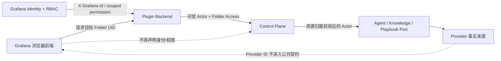

# Aegis SRE 权限与资源归属设计

- 状态：设计基线
- 日期：2026-08-16
- 适用范围：Grafana App Plugin、Plugin Backend、Control Plane、Agent、Knowledge、Playbook、Canvas、MCP

本文说明 Aegis SRE 如何复用 Grafana 的身份、Folder 和 RBAC 能力，并明确各类产品资源究竟归
User、Folder、Grafana 还是外部 Provider 所有。文中严格区分“当前代码已经实现的行为”和“目标设计”，
未完成能力不能被描述为已经具备生产权限保证。

本文不是新的资源存储规范。Agent Session、Knowledge、Dagu Playbook/Run 仍由对应 Provider 持久化，
Control Plane 不为授权建立影子资源表。实现若无法遵守 [基本架构](architecture.md)，必须先提交 ADR。

## 1. 目标与非目标

### 1.1 目标

1. 复用 Grafana Folder 作为团队共享运维资源的授权作用域。
2. 区分 User-owned 私人工作状态和 Folder-owned 团队资产。
3. 浏览器只能选择请求目标，不能声明自己的身份、角色或权限。
4. Plugin Backend 使用 Grafana 的可信身份和 RBAC 做最终 Folder 权限判断。
5. Control Plane 和 Provider 对资源实际归属做第二次校验，公共 ID 不是授权凭证。
6. REST、SSE、文件下载和 MCP 对同一资源采用一致的权限语义。
7. 权限缺失、权限服务不可用和资源越界时默认拒绝，不回退到 fixture 或宽松角色判断。

### 1.2 非目标

- 不在 Aegis 中复制 Grafana 用户、团队、Folder 或权限表。
- 不让 Control Plane 直接依赖 Grafana SDK、action 名称或 `authlib` 类型。
- 不用前端隐藏按钮代替服务端授权。
- 不把 Grafana Folder 当作 Prometheus、Loki 或其他数据源的行级安全边界。
- 不为 Playbook Folder 归属新增 Aegis 影子数据库。
- 不信任模型或 MCP 参数中的 `folder_uid`。

## 2. 身份、归属与操作上下文

### 2.1 Tenant 与 Org

`TenantID` 和 `OrgID` 是最外层隔离边界，用于区分部署租户和 Grafana Organization。任何公共资源
查询至少必须限定在当前 Tenant/Org；跨 Org 的相同资源 ID 不能互相发现或操作。

当前 Grafana 托管插件 Service Account 和 `externalServiceAccounts` 仅适用于单 Organization 部署。
如果产品需要多 Org，必须重新设计 Plugin Backend 获取用户权限的可信链路，不能假设当前机制天然支持。

### 2.2 User Owner

User owner 表示资源是某个用户的私人工作状态。其他用户即使拥有同一 Folder 的 Admin 权限，也不会
自动获得该私人资源的读取权限。

典型 User-owned 资源：

- 私人 Agent Session；
- Session 下的私人 Canvas；
- 尚未发布的 Skill 草稿（目标设计，当前真实模式尚未接通）；
- 只属于当前用户的偏好和临时编辑状态。

### 2.3 Folder Owner

Folder owner 表示资源是团队共享运维资产。资源跟随 Folder 生命周期和权限，而不是跟随创建者：

- 用户离开团队后，Folder 资源仍然保留；
- 用户失去 Folder 权限后，不能继续读取或操作资源；
- 子资源默认继承父资源的 Folder；
- 跨 Folder 移动是显式高风险操作，不能通过修改浏览器字段完成。

典型 Folder-owned 资源：

- Knowledge Base、Document、Passage、索引状态和检索结果；
- 人类阅读的 Runbook 文档；
- 共享且可执行的 Playbook；
- Playbook Run、Step、Approval 和 Artifact；
- 发布后的团队 Skill。

这里的 owner 是授权归属，不表示资源物理存储在 Grafana Folder 中。Knowledge 文档仍存放在 Knowledge
Provider，Playbook 仍存放在 Dagu。Grafana 删除 Folder 不会自动删除这些外部数据，而且用户可能通过
Grafana 原生 UI/API 删除 Folder，Aegis 不能把“所有删除都能被提前拦截”作为系统不变量。资源生命周期
必须遵守以下规则：

1. Aegis 能控制的 Folder 删除入口必须先执行关联资源 preflight；存在资源时要求先迁移/归档，或进入明确的
   受审计清理流程。
2. 每次访问 Folder-owned 资源都要重新确认 Folder 仍存在并完成授权。Folder 不存在、授权服务无法确认，或
   Provider 资源归属与已授权 Folder 不一致时必须 fail-closed；公共资源 ID 不能继续打开孤儿资源。
3. 外部删除不会自动级联删除 Knowledge、Dagu 等 Provider 数据。后台 reconciliation 只负责发现、报告和标记
   orphan，不得静默改变归属或删除 Provider 数据。
4. orphan 恢复只能通过独立的 Org Admin 治理入口执行：重新读取 Provider 中的原始归属，为目标 Folder 校验
   `admin`，记录迁移/归档/删除决定和操作者。普通资源 API 不得以 Org Admin 身份绕过已消失的 Folder。

因此安全不变量是“无法验证 Folder 时资源不可访问”，删除前拦截只是 Aegis 受控入口提供的生命周期保护。

### 2.4 Grafana-owned 资源

Dashboard、Alert Rule、Folder、用户、团队和 Grafana 原生权限由 Grafana 持有。Aegis 只通过官方
API、MCP 或插件后端查询和操作，不保存副本，也不创建第二套权限规则。

Aegis 产品界面不提供 Folder 创建、改名、删除或授权入口。用户应在 Grafana 原生 UI/API 中完成这些管理操作；
当当前用户没有可用 Folder 时，Aegis 只提示用户先在 Grafana 创建 Folder 或联系管理员授权。

根 Compose 是唯一的开发例外：`grafana-bootstrap` 接受可重复的 `--ensure-folder=uid:title` 参数，并在每次
`make local-up` 时通过 Grafana 官方 API 幂等确保测试 Folder `infra` 和 `payment` 存在。这个 bootstrap：

- 只用于本地测试，不是生产控制面能力；
- Folder 已存在时不修改名称、权限或其中资源；
- 不建立 Aegis Folder 表，也不改变 Grafana 是唯一事实来源的边界；
- 生产部署不得传入 `--ensure-folder`。

### 2.5 请求时 Folder Context

请求时 Folder context 表示“本次操作希望使用哪个 Folder”，不等于资源本身属于该 Folder。

例如 Session 属于 Alice，但 Alice 可以在某个 Turn 中选择 Payment Folder 查询 Dashboard、Knowledge
和 Playbook。此时：

```text
Session owner = Alice
Turn authorization context = Payment Folder
```

Plugin Backend 必须在每次受保护操作时重新验证 Alice 当前对 Payment 的权限。浏览器提供的 Folder UID
只是待验证的资源标识，不能直接转发为可信 Actor Context。

### 2.6 Grafana Team

Grafana Team 是权限授予主体，不是 Aegis 资源 owner。一个用户可以因 Team 成员关系、直接授权或
Grafana 的基础角色获得 Folder 权限；Aegis 不复制 Team membership，也不自行推导这些规则，而是让
Plugin Backend 针对当前用户、action 和 Folder scope 查询 Grafana authz 的最终结果。

因此人员调整只需要在 Grafana 中完成：加入 Team 后获得相应 Folder 资源能力，移出 Team 或撤销授权后，
新的请求在权限缓存到期后被拒绝。Plugin Backend 的托管 Service Account 只用于调用授权服务，不代表
最终用户权限，也不能用 Service Account 自身权限代替用户权限判断。

## 3. 信任边界与调用链



### 3.1 浏览器

浏览器可以提交：

- 想操作的公开资源 ID；
- 当前选择的 Folder UID；
- 业务输入和幂等键。

浏览器不得成为以下字段的可信来源：

- Tenant、Org、User、Role；
- Folder access level；
- Provider ID、Provider credential；
- MCP 服务身份。

### 3.2 Plugin Backend

Plugin Backend 是 Grafana-specific 授权适配层，负责：

1. 从 Grafana Plugin Context 读取可信 Tenant、Org 和 User。
2. 拒绝缺少或格式错误的 `X-Grafana-Id`。
3. 使用托管 Service Account 初始化 `authz.EnforcementClient`。
4. 对 `folders:uid:<uid>` 执行 scoped action 校验。
5. 删除浏览器伪造的 Aegis 身份和权限 Header。
6. 向 Control Plane 注入可信 Actor、Folder UID 和最小访问级别。
7. Grafana 授权服务异常时返回受控 `503`，不能按允许处理。

Plugin Backend 仍然只是身份、授权和协议代理，不实现资源归属数据库或业务状态机。

### 3.3 Control Plane

Control Plane 不调用 Grafana RBAC，而是信任经过内部服务凭据认证的 Plugin Backend 断言。它负责：

1. 强制验证内部 Plugin Token；生产模式不得允许空 Token。
2. 将可信 Header 解析为 Provider-neutral 请求授权上下文。
3. 校验操作所需的最小 Folder access。
4. 校验 body/query/path 中的 Folder 与可信 Folder 一致。
5. 读取 Provider 资源后再次确认其实际 User/Folder scope。
6. 对越界资源优先返回 `404`，避免泄漏资源是否存在。

### 3.4 Provider

Provider adapter 必须使用稳定的公共 scope 重新验证资源，不能因为 Control Plane 已经检查过就省略：

- Knowledge adapter 校验 Actor/Folder scope 和公共 ID metadata；
- Agent adapter 校验 Tenant/Org/User 会话空间；
- Dagu adapter 必须只暴露当前 scope 的 Aegis-managed `pbk_` 资源；
- Provider 原生 ID、SDK 类型和权限协议不能进入领域模型或前端。

## 4. Folder Access 模型

领域内只使用 Provider-neutral 的三个访问级别：

| Access | 含义 | 典型操作 |
| --- | --- | --- |
| `read` | 使用和读取 Folder 资源 | 列表、详情、搜索、下载、查看运行 |
| `write` | 修改资源或产生运行副作用 | 创建、更新、上传、执行、取消、重试 |
| `admin` | 管理归属或处理高风险治理操作 | 删除共享根资源、发布、迁移归属、高风险审批 |

Grafana action string 只允许存在于 `grafana-plugin/pkg/plugin`。建议统一定义以下插件 action：

```json
{
  "actionSets": [
    {
      "action": "folders:view",
      "actions": ["grafana-plugin-app.folder-resources:read"]
    },
    {
      "action": "folders:edit",
      "actions": [
        "grafana-plugin-app.folder-resources:read",
        "grafana-plugin-app.folder-resources:write"
      ]
    },
    {
      "action": "folders:admin",
      "actions": [
        "grafana-plugin-app.folder-resources:read",
        "grafana-plugin-app.folder-resources:write",
        "grafana-plugin-app.folder-resources:admin"
      ]
    }
  ]
}
```

`read` 在 Edit/Admin action set 中显式重复，避免依赖隐式继承。修改 `plugin.json` 后必须重启 Grafana。

如果未来需要让某个团队只能使用 Knowledge、不能执行 Playbook，可在不改变领域模型的前提下增加
domain-specific action。首版优先保持统一 Folder access，避免每个模块复制一套 RBAC 基础设施。

## 5. 资源归属总表

| 功能 | 事实来源 | 目标归属 | 当前状态 | 目标权限 |
| --- | --- | --- | --- | --- |
| Session / Message / Turn | Agent Provider | User | 单 Actor scope；Turn 已校验请求时 Folder，Folder 不持久化 | owner；Turn 额外校验 Folder |
| Canvas | Aegis SQLite | Session/User | SQLite 以 Tenant/Org/User/Session 为主键 | 继承 Session owner |
| Knowledge Base / Document | Knowledge Provider | Folder | 已完成通用 Folder 授权、父级复核和 v1 只读兼容 | read/write/admin |
| 人类 Runbook | Knowledge Provider | Folder | 真实页面暂未形成分类闭环 | 按 Knowledge 文档处理 |
| Playbook | Dagu YAML | Folder | Dagu 原生 label 保存 Folder ownership；旧资源只读兼容 | read/write/admin |
| Run / Step / Artifact | Dagu | Playbook Folder | 所有操作从 Run 追溯并复核 Playbook Folder | 继承 Playbook |
| Skill 草稿 | 未接真实 Provider | User | real 模式不可用 | owner |
| 发布 Skill | 未接真实 Provider | Folder | real 模式不可用 | read/write/admin |
| Alert Rule / Dashboard | Grafana | Grafana Folder | real 功能尚未完整接通 | Grafana 原生权限 |
| Approval | Agent/Dagu/目标 Provider | 继承目标 | Dagu 按 Playbook Folder；Agent approve 暂时 fail-closed | 按目标资源和风险 |
| Audit | 可观测性/审计事实来源 | 继承事件目标 | 两层已输出结构化授权日志；页面仍为 fixture | Folder/User/Org 投影 |
| Plugin Configuration | Grafana Plugin Settings | Org | 当前配置页限 Admin | Org Admin |

## 6. Workbench、Session 与 Agent

### 6.1 目标归属

Session、Message 和 Canvas 是 User-owned。Folder 是每次 Agent Turn 的授权上下文，不是 Session 的
持久化属性。当前 OpenAPI 已将 `Session.folder_uid` 标记为 deprecated，并明确 Agent Provider 不持久化。

目标权限：

| 操作 | User 条件 | Folder 条件 |
| --- | --- | --- |
| 列出/打开 Session | 当前用户是 owner | 不要求 Folder |
| 创建/改名/归档/删除 Session | 当前用户是 owner | 不要求 Folder |
| 读取/修改 Canvas 布局 | 当前用户是 Session owner | 不单独要求 Folder |
| 发起只读调查 Turn | 当前用户是 Session owner | 目标 Folder `read` |
| Agent 调用 Knowledge/Playbook | 当前用户是 Session owner | 对目标资源重新校验 |
| Agent 调用 Grafana 写工具 | 当前用户是 Session owner | 目标 Folder `write`，工具层再次校验 |
| 批准高风险写操作 | 当前用户是 Session owner | `write` 或 `admin`，按工具风险定义 |

### 6.2 当前代码状态

- `ActorContext` 已包含 Tenant/Org/User/Folder/Roles。
- `agentscope.Provider` 当前校验部署配置中的固定 Tenant/Org/User，属于单 Actor 过渡实现。
- Session 公共模型和 `CreateAgentSessionInput` 不持久化 Folder。
- Control Plane 在 StartTurn 时把可信 Actor Folder 放入 `StartTurnInput.FolderUID`。
- 真实 Workbench Gateway 在 `turns:stream` 请求中发送 active Folder Header，Plugin Backend 要求 Folder read；
  Session CRUD 不要求 Folder，继续由 Agent Provider 校验 owner。
- 当前 Codex pending Approval 无法持久化可信 Folder/目标/revision，因此 approve 返回
  `capability_unavailable`；浏览器状态不会被当作授权事实。reject 仍可用于安全终止等待。
- 逐 Turn 用户委托尚未落地；固定身份 Playbook MCP 写工具默认关闭，不能用于多用户模式。

### 6.3 历史会话权限撤销语义

当前目标是“授权时点快照”语义：用户失去 Folder 权限后，仍可读取自己的历史 Session，但不能在该
Folder 上发起新 Turn、重新查询数据或批准新操作。历史消息可能包含此前合法读取的信息。

如果产品要求权限撤销后连历史消息也不可读，必须把 Session 改成 Folder-bound 资源。这会改变
`AgentProvider`、公开 Schema、Provider metadata 和迁移语义，实施前必须提交 ADR。

### 6.4 数据源权限不是 Folder 权限

Grafana Folder 主要保护 Dashboard、Alert Rule 和通过 action set 扩展的插件资源。它不会自动对
Prometheus/Loki 查询提供行级隔离。Agent 查询数据仍须依赖 Grafana Data Source RBAC、低权限 Service
Account、只读/写 MCP 分离和网关 allowlist。不能因为用户能查看某 Folder，就假设其可以查询任意数据源。

## 7. Knowledge 与人类 Runbook

### 7.1 目标归属

Knowledge Base 是 Folder-owned 根资源，Document、Passage、索引状态和检索引用继承 Knowledge Base Folder。
人类阅读的故障手册和操作说明作为 Knowledge Document 或标签分类存在，不具备执行语义。

| 操作 | 最小权限 |
| --- | --- |
| 列表、详情、检索、Passage、下载 | `read` |
| 创建 Knowledge Base、上传文档、更新元数据、失败索引重试 | `write` |
| 删除 Document | `write` |
| 删除空 Knowledge Base | `admin` |

### 7.2 当前代码状态

Knowledge 已形成首版完整参考链路：

- 前端 Gateway 提交 Folder UID Header；
- Plugin Backend 使用 Grafana scoped action 检查 Folder；
- Control Plane 要求可信 `X-Aegis-Folder-Access`；
- Knowledge v2 公共 ID 和 Provider metadata 绑定 Tenant/Org/Folder scope，不再绑定创建用户；
- 目标态只使用 RAGLite adapter，并在读取和变更时重新校验 scope；
- legacy v1 数据通过受控迁移或归档流程处理，scope migration 和跨 Folder 迁移不进入首版公共 API；
- Knowledge MCP 使用服务端 Token 绑定固定 Actor 和 Folder allowlist。

兼容和验收边界：

- 旧 v1 scope 仍绑定 User，仅允许原创建者在同 Folder 只读；目标公共 API 上线前完成受控迁移或归档；
- Knowledge Base 删除要求 Folder admin，Document 删除要求 write；
- real 模式 Folder 选择器和 View/Edit/Admin 按钮控制已接入；
- 真实浏览器到 Provider 的跨 Folder E2E 尚未成为发布门禁。

## 8. Playbook、Run、Approval 与 Artifact

### 8.1 目标归属

首版真实可执行 Playbook 全部视为 Folder-owned 团队资产，不把 fixture 中的私人 Playbook 语义直接
迁移到真实 Dagu 链路。未保存的编辑内容只是浏览器临时状态，不是第二事实来源。

Run、Step、Human Task、Approval、日志和 Artifact 全部继承 Playbook Folder：

```text
Folder
└── Playbook (Dagu YAML)
    └── Run
        ├── Step / Human Task
        ├── Approval
        └── Artifact
```

| 操作 | 最小权限 |
| --- | --- |
| 列表、详情、YAML、Run、事件、Artifact 预览/下载 | `read` |
| 创建、更新、校验并保存、启动、取消、重试、完成人工任务 | `write` |
| 删除 Playbook、改变归属、高风险审批 | `admin` |

是否允许 Folder View 用户启动无副作用 Playbook 不在首版展开。默认所有 Run 都可能产生副作用，因此启动
统一要求 `write`，不能依赖 YAML 中由调用方自由声明的 `side_effect` 字段降低权限。

### 8.2 当前代码状态与兼容边界

- Dagu YAML 是唯一事实来源，Control Plane 不保存副本。
- `PlaybookResource` 暴露经 Provider 复核的 `folder_uid`；前端拒绝与请求 Folder 不一致的响应。
- 新 Playbook 公共 ID 使用 Tenant/Org/Folder scope，Dagu YAML 原生 label 保存不可逆 Folder ownership 指纹。
- List/Get/Run/SSE/Human Task/Approval/Artifact 均先恢复 Playbook，并复核请求 Folder 与原生 label。
- Plugin Backend、Control Plane 和真实 Playbook Gateway 已统一使用 Folder read/write/admin，不再用 Grafana Org
  Editor/Admin role 授权 Folder 资源。
- 配置 `AEGIS_PLAYBOOK_LEGACY_FOLDER_UID` 后，旧 Org-scoped、无 ownership label 的 Playbook 仅可在该 Folder
  读取一到两个发布周期；所有变更和执行操作均 fail-closed。
- 未新增 ownership 影子表，也未把 fixture 的 `visibility/folder_uid` 当成生产事实。
- 真实 Dagu 的多用户跨 Folder、SSE 断线恢复和 Artifact 下载仍需作为生产 E2E 门禁执行。

## 9. Skill

Skills 当前在 real 模式下明确不可用，因此其权限模型仍属于目标设计。

Skill、Alerts 和 Audit 在真实模块接通时必须遵循的完整权限矩阵、服务端边界和验收门禁见
[Skill、Alerts 与 Audit 权限接入设计](deferred-module-authorization.md)。

建议采用“私人草稿 -> 显式发布”的生命周期：

| 状态 | 归属 | 权限 |
| --- | --- | --- |
| 私人 Skill | User | owner 可读写删除 |
| 发布到 Folder 的 Skill | Folder | read 可使用，write 可编辑，admin 可撤回/删除/迁移 |
| 系统内置 Skill | Deployment | 普通用户只读，随版本发布 |

发布操作必须由目标 Folder Admin 执行或审批。共享 Skill 调用 Knowledge、Playbook、Grafana MCP 时，仍按
本次执行的目标 Folder 和工具风险重新授权；拥有 Skill 的读取权限不等于拥有 Skill 内所有工具的权限。

Skill 的真实事实来源、版本和发布元数据尚未冻结。接入前必须先确定 Provider/port，真实模式不得使用
浏览器 LocalStorage 或 fixture 冒充持久化。

## 10. Alert、Dashboard 与其他 Grafana 资源

Alert Rule、Dashboard 和 Folder 由 Grafana 持有，Aegis 不定义第二套 owner：

- 列表和详情沿用 Grafana 原生 Folder 可见性；
- 修改、静默、删除等操作使用 Grafana 原生 action 和 scope；
- Agent 通过受限 Grafana MCP 调用，浏览器不直接持有服务凭据；
- Aegis 不缓存规则副本来绕过权限检查。

如果未来增加负责人、处置状态、事故备注等产品字段，必须先明确唯一事实来源。优先复用 Grafana
annotation、Alerting API 或明确的外部 Incident Provider；不能在 fixture 模型基础上静默增加数据库。

当前 Alerts 页面在 real 模式下仍是 pending，fixture 中根据 Folder permission 控制按钮不构成真实授权。

## 11. Approval

Approval 不是独立授权根，它继承被审批操作的目标：

| Approval 类型 | 归属 | 建议权限 |
| --- | --- | --- |
| Agent Provider 原生工具审批 | Session + 目标 Folder | owner 且 Folder `write/admin` |
| Playbook Step 审批 | Playbook Folder | `write` 或按风险要求 `admin` |
| Skill 发布 | 目标 Folder | `admin` |
| 空 Knowledge Base 删除 | Knowledge Folder | `admin` |

批准按钮在前端隐藏只是体验控制。服务端必须重新读取审批/Run/Session，解析实际目标，再检查权限。审批 ID
不能携带完整权限声明，也不能因为创建审批时已校验就跳过处理时的复验。

### 11.1 审批目标的可信事实来源

浏览器处理审批时只提交 approval ID、decision、reason 和并发控制字段，不提交可被信任的 Folder、权限等级或
目标资源。服务端必须从审批事实来源恢复以下不可变目标信息：

- owner 引用，例如 Agent Session/Turn 或 Dagu Run/Playbook；
- operation/tool 和目标资源类型、公共 ID；
- 目标 Folder UID、所需 `write/admin` 和风险等级；
- Provider revision 或等价的状态版本，防止审批目标在处理中被替换。

Playbook 审批优先通过 `Approval -> Run -> Playbook -> Folder` 从 Dagu 原生事实解析。Agent Provider 原生工具审批
必须由 Provider 的 tool-call/approval metadata 保存上述目标，或保存由 Aegis 服务端签名的不可变目标上下文；
签名上下文只证明“审批创建时绑定了什么目标”，不是可延续到审批时的权限凭据。它必须存放在 Provider 原生
审批记录旁并通过 `internal/ports` 读取，不能由浏览器回传，也不能为此建立 Approval 影子表。

处理审批时，服务端按以下顺序执行：

1. 读取 Approval 及其 owner，确认当前用户仍是 Session owner 或满足目标资源的主体要求；
2. 从 Provider 原生关系或校验过签名的上下文恢复真实 Folder、operation 和 required access；
3. 对当前用户和真实 Folder 执行实时授权，并检查 Approval revision/state；
4. 为本次执行签发新的短期委托能力，再调用 Provider；创建审批时的授权结果不能复用。

如果 Agent Provider 无法保存或返回可信目标，real 模式必须对该类审批返回
`capability_unavailable`，不得使用前端瞬时状态（例如 React ref）或浏览器补传的 `folder_uid` 放行。当前单 Actor
过渡部署也只有在服务端配置将审批明确绑定到唯一 Folder 时才可启用，不能把固定 Actor 自动等同于任意 Folder
权限。若所选 Agent Provider 需要扩展 metadata 或公开契约，实施前提交 ADR。

当前统一 Approvals 页面在 real 模式下尚未接通；Agent 和 Dagu 各自的原生审批通过对应 Provider API 处理。

## 12. Audit

Audit 是事件投影，不是独立业务资源。每条事件至少应携带：

- `tenant_id`、`org_id`、`actor_user_id`；
- `requested_folder_uid`：经长度和格式限制后的请求值，可能来自浏览器，不代表已授权；
- `authorized_folder_uid`：Plugin Backend 已为 required access 验证的 Folder，未通过授权时为空；
- `resource_folder_uid`：从 Provider 事实读取并完成一致性校验的资源归属，尚未读取或不允许披露时为空；
- 资源类型和公共资源 ID；拒绝枚举时只记录内部受控标识或脱敏值；
- action、`required_access`、`granted_access`、decision/result、受控错误码和授权来源；
- request ID、trace ID、时间；
- 不包含 Provider credential、原始 Token 和敏感 Provider 响应。

`requested_folder_uid` 绝不能在日志流水线中被提升或复制成 `authorized_folder_uid`。只有 Plugin Backend 成功完成
Grafana scoped action 校验后才能写入 authorized scope；只有 Control Plane 从 Provider 读取资源归属并完成
一致性检查后才能写入 resource scope。这样可以区分“用户声称访问 Folder A”“用户被允许访问 Folder A”和
“资源确实属于 Folder A”。

读取策略：

- Folder 资源事件要求当前用户对该 Folder 至少有 `read`；
- 私人 Session/Canvas 事件只对 owner 可见；
- Org Admin 可以读取组织级安全和配置事件；
- 没有 `authorized_folder_uid` 的拒绝事件不能按请求 Folder 暴露给普通用户，只进入受控的安全审计视图；
- 权限拒绝事件对客户端只显示必要元数据，不能泄漏资源是否存在、真实归属或内容。

当前 Audit 页面和 store 是 fixture，不应作为生产审计事实来源。生产实现应优先基于结构化日志和既有
可观测性系统形成只读投影，保留策略、检索范围和脱敏规则需另行冻结。

当前 Control Plane 的结构化请求日志已区分可信 Actor、requested/authorized/resource Folder scope；
Knowledge、Playbook、Run 和 Agent Turn 仅在 Provider 操作成功且归属与 authorized Folder 一致后写入
`resource_folder_uid`。Agent 原生 Approval 在服务端尚不能恢复可信目标，因此刻意不写 resource scope，
也不能据此开放审批。Audit 查询投影、保留策略和 UI 仍按延期模块设计执行。

## 13. Plugin Configuration、Capability 与健康检查

- Plugin Configuration 是 Org 级管理能力，只允许 Grafana Org Admin。
- Provider 地址和非敏感开关可以出现在服务端配置，凭据必须使用只读文件或 Secret Manager。
- 浏览器不能读取 Control Plane、Dagu、Knowledge Provider 或 MCP credential。
- capability 和 health 只返回可用性及受控原因，不返回内部地址、Token 路径或 Provider 原始错误。
- 未配置 Knowledge/Skill 等能力时明确返回 `capability_unavailable`，不能返回 fixture 数据。

## 14. MCP 与 Agent 工具授权

浏览器 REST 身份不能自动传播到 MCP。必须区分两类凭据：

- **工作负载身份**：长期或轮换的 MCP/Service Account 凭据，只证明 Agent、Control Plane 或网关服务是谁；
- **用户委托能力**：由可信服务端在完成 Grafana 授权后签发，证明某次 Turn 可以代表哪个用户在什么 Folder
  执行哪些操作。

工作负载身份不能代表当前 Grafana 用户，也不能单独授权 Folder 资源。当前部署中的固定凭据仍应保持最小权限：

- Knowledge MCP Token 绑定固定 Actor 和 Folder allowlist；
- Playbook MCP Token 绑定固定 Actor 和 Folder allowlist；
- Grafana MCP 通过独立鉴权网关和低权限 Service Account；
- 读写 Grafana MCP 必须使用不同凭据和 allowlist；
- Dagu `mcp.call` 只能调用配置白名单内 Server/Tool。

上述固定 Actor 模式只允许用于配置中唯一 Tenant/Org/User 的单 Actor 过渡部署，不得解释为多用户授权。进入
多用户 real 模式前，每个 Folder-scoped MCP 调用都必须携带服务端可验证的短期委托能力；在委托链路落地前，
Agent 的 Folder-scoped 写工具和审批后执行必须禁用。不能因为 StartTurn 已通过一次 Folder `read`，就允许固定
Service Account 在之后执行 `write/admin`。

委托能力至少绑定 issuer、audience、Tenant/Org/User、Session/Turn、Folder UID、最大 access、允许的 tool/action、
过期时间和唯一 ID。它由 Plugin Backend 完成实时 Grafana 授权后签发，或由 Control Plane 根据 Plugin Backend
传入的已验证授权断言换取；浏览器和模型都不能自行生成。MCP handler 的有效权限必须取以下交集：

```text
有效权限 = 用户委托能力 ∩ MCP 服务端 allowlist ∩ 工具风险策略 ∩ 工作负载凭据能力
```

任一层缺失、过期、audience 不匹配或权限不足都必须 fail-closed。模型提供的 `folder_uid` 只是请求参数，必须与
委托能力绑定的 Folder 完全一致；模型不能声明 User、Org、Role 或扩大 access。高风险审批处理时应重新检查当前
用户权限并签发新的短期能力，不能复用创建 Turn 或创建 Approval 时的 token。Token TTL 同时构成权限撤销的最大
传播延迟，必须记录为运行约束并覆盖测试。

委托能力的签发者、密钥轮换、Provider runtime 注入方式和吊销机制会改变跨模块安全契约，实施前必须提交 ADR。
不能把浏览器 Header、Grafana ID Token 或长期 Plugin Service Account Token 直接交给 Agent。

## 15. 前端职责

前端负责一致的交互体验，不承担最终授权：

1. 通过 Grafana `/api/search` 获取当前用户可见的 Folder，并通过
   `/api/access-control/user/permissions` 获取当前用户的 scoped action 集合。
2. real 模式提供 Folder 选择器；Folder 切换立即清空上一 scope 的数据和对话操作状态。
3. 所有 Folder-scoped Gateway 统一发送请求目标 Folder UID。
4. 将 action 的 `folders:uid:<uid>` 或 `folders:*` scope 与搜索结果 UID 精确匹配，控制按钮、路由和只读提示。
5. 收到服务端 `403` 时以服务端结果为准，即使前端此前判断可写。
6. 深链接必须携带或恢复目标 Folder context，然后由服务端验证；不能只凭资源 ID 打开。
7. 权限变化后刷新 Folder 列表和资源状态，不长期缓存可写判断。

Grafana Folder 搜索结果不保证包含插件自定义 `accessControl`。因此 real 模式必须把可见 Folder 列表与当前用户
permission map 分开读取，再用通用 scoped action 计算 Folder 能力；不能让各模块解释自己的
Knowledge/Playbook action：

| 当前用户 permission map 中匹配目标 Folder scope 的 action | 前端能力 |
| --- | --- |
| `grafana-plugin-app.folder-resources:admin` | `Admin`，同时具备 Edit/View |
| `grafana-plugin-app.folder-resources:write` | `Edit`，同时具备 View |
| `grafana-plugin-app.folder-resources:read` | `View` |
| 均不存在、scope 不匹配或权限响应无效 | 不可选择，不得默认成 `View` |

判断顺序必须是 Admin -> Edit -> View。允许的 scope 只有目标 Folder 的 `folders:uid:<uid>` 和覆盖全部 Folder 的
`folders:*`；不能用前缀、标题或其他 Folder 的 scope 猜测权限。permission map 无效时整个 Folder 列表
fail-closed。`hasPermission`、Folder 搜索结果和按钮状态只用于前端体验；Plugin Backend 仍对每次请求检查对应
scoped action，Admin 操作不能因为前端已显示按钮而降级成 write。

当前 `grafanaFolderGateway` 已并行读取 Folder 搜索结果和当前用户 permission map，按上述规则映射
View/Edit/Admin，并过滤无匹配 Aegis action 的 Folder。列表为空时 TopBar、Knowledge 和 Playbook 页面提示用户
先在 Grafana 创建 Folder 或联系管理员授权；搜索词没有结果时仍显示“没有匹配的 Folder”，两种状态不能混淆。

## 16. Plugin Backend 路由策略

应把当前 Knowledge 专用的路径判断替换为集中、可测试的策略解析器。策略至少包含：

```go
type FolderAccess string

const (
	FolderRead  FolderAccess = "read"
	FolderWrite FolderAccess = "write"
	FolderAdmin FolderAccess = "admin"
)

type RoutePolicy struct {
	FolderRequired bool
	Access         FolderAccess
}
```

策略必须覆盖普通 REST、SSE 和下载路径。不能只按 HTTP Method 粗略判断：审批、运行和删除的风险级别取决于
具体业务 action。所有 `/api/v1/` 路由都应明确属于以下之一：

- 不需要 Folder、但需要可信 User；
- 需要 Folder read；
- 需要 Folder write；
- 需要 Folder admin；
- 明确拒绝的未知路由。

authz client 的 permission search prefix 应覆盖所有 Aegis action，而不是只搜索 Knowledge 前缀。当前
10 秒本地权限缓存可以保留，但必须把权限撤销最多延迟一个缓存 TTL 记录为运行约束，并覆盖测试。

## 17. Control Plane 统一授权上下文

当前 `ActorContext` 包含 Folder UID 和 Grafana Roles，但 Folder access 仍由 Knowledge handler 直接读取
Header。目标应把请求身份与授权断言统一解析一次，例如：

```text
ActorContext
- TenantID
- OrgID
- UserID
- Roles（仅用于 Org 级能力）

FolderAuthorization（可选）
- UID
- Access: read | write | admin
```

Grafana Roles 不应用于 Folder-owned 资源写入。Folder authorization 可以作为应用层请求上下文存在，
不必扩张每个 Provider port 的输入；Provider 只接收完成授权后的 Actor 和必要资源 scope。

Control Plane 应提供统一的 `requireFolderAccess`、Folder 一致性和越界隐藏逻辑，避免 Knowledge、Playbook、
Skills 各自解析 Header。Header 名称是平台传输细节，不应散落到 application/domain/adapter。

## 18. 错误语义

| 场景 | HTTP | 公共错误码 | 说明 |
| --- | --- | --- | --- |
| 缺少可信 Grafana/User 身份 | 401 | `unauthenticated` | 不进入 Provider |
| 缺少 Folder context | 403 | `forbidden` | Folder-scoped 路由默认拒绝 |
| 已知 Folder 权限不足 | 403 | `forbidden` | 不透露 Provider 细节 |
| 已授权 Folder 下找不到资源或资源实际越界 | 404 | `not_found` | 防止枚举其他 scope |
| Grafana authz 不可用 | 503 | `provider_unavailable` | 不按允许处理 |
| 功能未配置 | 503 | `capability_unavailable` | 不回退 fixture |
| revision/状态冲突 | 409 | `conflict` | 与权限错误分开 |

错误正文不得包含 Grafana ID Token、Service Account Token、Provider ID、内部 URL 或 Provider 原始响应。

## 19. 测试与验收门禁

### 19.1 Plugin Backend

- 浏览器伪造 Actor、Role、Folder access Header 会被删除；
- 缺少 `X-Grafana-Id` 返回 401；
- read/write/admin 路由调用正确 scoped action；
- View 不能执行 write/admin；Edit 可以 read/write 但不能 admin；
- Folder 已被 Grafana 外部删除时，普通资源 API fail-closed 且不会调用 Provider；
- Grafana authz 异常返回 503；
- SSE、文件预览和下载与普通 REST 使用相同策略；
- 未知路由不能绕过 Folder middleware；
- permission cache 到期后权限撤销生效。

### 19.2 Control Plane 与 Provider

- body/query Folder 与可信 Folder 不一致时拒绝；
- 公共 ID 猜测不能跨 User/Folder/Org 读取；
- list/get/update/delete/search/run/artifact 均覆盖跨 scope 测试；
- Provider 返回错误 scope metadata 时视为 `provider_result_unknown` 或拒绝；
- 幂等重试不能改变资源 owner/scope；
- 权限失败不能产生 Provider 写调用；
- MCP 委托能力缺失、过期、audience/tool/Folder 不匹配或高于服务端 allowlist 时拒绝；
- 只有工作负载凭据、没有用户委托能力时，多用户 real 模式不能执行 Folder-scoped MCP 调用；
- 审批忽略浏览器提交的 Folder，从 Provider 事实恢复目标并实时复验；无法恢复目标时 fail-closed；
- orphan reconciliation 不自动删除或改变 Provider 资源归属，治理操作具有完整审计记录。

### 19.3 前端 E2E

- real 模式只显示用户可见 Folder；
- 通用 read/write/admin action 的精确 Folder scope 分别映射为 View/Edit/Admin，权限响应缺失或无效时 fail-closed；
- Grafana 搜索结果没有插件 `accessControl` 字段时，仍能依据当前用户 permission map 正确列出 Folder；
- 无可用 Folder 时引导用户在 Grafana 创建或申请权限，搜索无匹配结果时显示独立状态；
- Folder 切换不短暂显示上一 Folder 数据；
- View 用户看不到或不能触发写按钮；
- 即使强制发送写请求，服务端仍返回 403；
- 深链接、刷新、SSE 重连和文件下载重新执行授权；
- 权限被撤销后刷新进入明确无权状态；
- real 模式不会因 Provider 不可用而出现 fixture 内容。

### 19.4 真实部署验收

- 使用至少三个用户验证 Folder View/Edit/Admin；
- 验证用户对不同 Folder 拥有不同级别时不会串权；
- 验证托管 Service Account 缺失、Token 轮换和 Grafana 重启；
- 验证 Knowledge、Agent Turn、Playbook Run 和 Artifact 的完整调用链；
- 验证 Agent 工具委托不会超过当前用户、目标 Folder、工具策略和工作负载凭据的权限交集；
- 验证结构化审计区分 requested/authorized/resource Folder scope，并包含 actor、action、result 和 trace，且无
  凭据泄漏。

## 20. 分阶段实施顺序

### 阶段 A：冻结语义

1. 确认本文资源归属矩阵。
2. 提交 Session 历史权限语义 ADR（仅当不接受当前授权时点快照语义）。
3. 提交 Playbook Folder ownership ADR，明确 Dagu 原生事实来源承载方式和旧 ID 兼容窗口。
4. 启用多用户 Agent MCP 或 Agent Approval 前，提交委托能力与可信审批目标 ADR；未完成时保持相关 real 能力禁用。

### 阶段 B：通用基础设施

1. 将 `plugin.json` Knowledge action set 改为通用 Folder resource actions。
2. 抽取 Plugin Backend Route Policy 和 Folder Authorizer。
3. 扩大 authz permission prefix，并加入 admin 级别。
4. Control Plane 统一解析可信 Folder authorization。
5. 前端 Gateway 统一解析通用 action，缺少权限数据时 fail-closed，再开放 real 模式 Folder 选择器。
6. 结构化审计区分 requested、authorized 和 resource Folder scope。

### 阶段 C：按模块迁移

1. Knowledge 迁移到通用授权器，保持现有行为并增加 admin。
2. Workbench Turn 传递 Folder UID；Session/Canvas 保持 User-owned；按 ADR 接入逐 Turn 委托能力后才开放多用户工具调用。
3. Playbook ADR 落地后接入 Playbook/Run/Artifact/Approval，并从 Provider 关系恢复审批目标。
4. Skill Provider 确定后实现 User draft 和 Folder publish。
5. Alert、Dashboard 继续使用 Grafana 原生权限，不进入通用 Aegis ownership store。

### 阶段 D：生产化

1. 权限撤销、Token 轮换和 Grafana authz 故障演练。
2. 全链路审计、敏感字段脱敏和保留策略。
3. 多用户真实 E2E 和跨 Folder 拒绝测试成为发布门禁。
4. 如需多 Org，先替换当前单 Org 托管 Service Account 假设。
5. 建立 Folder orphan inventory/reconciliation 和受审计治理入口，不自动级联删除 Provider 数据。

只读 inventory 已由 [`cmd/ownership-inventory`](ownership-inventory.md) 落地：它实时读取 Grafana Folder，枚举
Dagu/Knowledge Provider 原生 ownership，并输出 active/orphan/legacy/invalid；治理修改入口仍需单独设计和审计。

## 21. 必须先确认的未决问题

以下首版语义已经冻结：Session 历史采用授权时点快照；Playbook 使用 Dagu 原生 labels 保存 Folder owner；删除
Knowledge Base/Playbook 和处理 Approval 要求 Admin；Control Plane 签发 5 分钟逐 Turn 用户委托；Provider 无法
保存可信 Approval target 时禁用 approve。实现细节见 ADR 0009 和 ADR 0010。

仍需确认：

1. Skill 是否需要私人草稿，还是所有真实 Skill 都直接 Folder-owned？
2. 生产是否保持单 Grafana Org；如果不是，可信用户授权链如何替代 `externalServiceAccounts`？
3. Audit 的唯一事实来源、保留期限和 Org Admin 查询能力由哪个现有系统承载？
4. Folder orphan 的 inventory/reconciliation 由哪个现有系统承载，Org Admin 治理入口的恢复与删除策略是什么？

这些问题会改变跨模块公共契约、Provider metadata 或资源生命周期。未确认前可以建设通用授权基础设施，
但不能通过临时数据库、fixture 字段或前端判断提前固化答案。

## 22. 相关文档

- [Aegis SRE 基本架构](architecture.md)
- [整体实施计划](implementation-plan.md)
- [统一权限实施计划](authorization-implementation-plan.md)
- [Skill、Alerts 与 Audit 权限接入设计](deferred-module-authorization.md)
- [Agent 公开标识 ADR](adr/0002-agent-public-identifiers.md)
- [Agent Provider Runtime 与 Scope ADR](adr/0003-agent-provider-runtime-and-scope.md)
- [Knowledge 身份与 Folder 授权 ADR](adr/0004-knowledge-identity-and-folder-authorization.md)
- [Dagu Playbook 写入归属 ADR](adr/0001-dagu-authoring-ownership.md)
- [Agent/Playbook MCP 边界 ADR](adr/0005-agent-playbook-mcp-boundary.md)
- [Canvas SQLite 持久化 ADR](adr/0007-canvas-sqlite-persistence.md)
- [Playbook Folder Ownership ADR](adr/0009-playbook-folder-ownership.md)
- [Agent 委托与 Approval 目标 ADR](adr/0010-agent-delegation-and-approval-target.md)
- [Grafana App Plugin RBAC 官方文档](https://grafana.com/developers/plugin-tools/how-to-guides/app-plugins/implement-rbac-in-app-plugins)
- [Grafana App Plugin Service Account 官方文档](https://grafana.com/developers/plugin-tools/how-to-guides/app-plugins/use-a-service-account)
