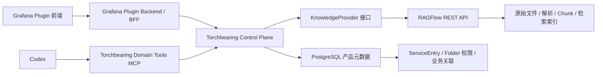

# 知识库替换调研与建议

> 调研日期：2026-08-13  
> 范围：以成熟开源方案替换 Torchbearing 当前手写的文档解析、切分、向量化和检索实现；保留 Grafana 插件形态与产品业务边界。

## 结论

推荐采用 **RAGFlow** 作为独立部署的文档与检索引擎，但不让它接管 Torchbearing 的整个 Knowledge 领域。

具体分工如下：

- RAGFlow 负责原始文件、文档解析、分块、Embedding、混合检索及引用位置。
- Torchbearing 保留 Grafana Folder 权限、服务目录、知识库与服务关联、文档业务分类、稳定 ID 与审计。
- Grafana 插件前端继续调用 Torchbearing API，不直接访问 RAGFlow。
- Codex 经 Torchbearing 的知识工具访问检索能力，不直接持有可全局检索的 RAGFlow 凭据。

这能以较小的产品结构变化，去掉当前最重、最通用的 RAG 基础设施实现，同时维持未来更换知识引擎的能力。

## 当前实现的实际职责

当前知识库并非单一的“向量检索”模块，而是混合了产品领域模型和通用 RAG 基础设施。

### 应继续由 Torchbearing 负责

- `ServiceEntry` 服务目录及别名、Owner、标签。
- Grafana Folder UID 作为权限范围。
- 服务与知识库的关联关系。
- 知识库分类，如业务、运维、Skill。
- 文档类型、标签、乐观锁版本和稳定业务 ID。
- 调用方鉴权、审计及 API 契约。

这些能力可见于 `api/knowledge/service.go`、`api/knowledge/knowledge_base.go` 与 `api/knowledge/document.go`，属于 Torchbearing 的产品模型，而不是通用知识库产品可以安全接管的职责。

### 应替换为成熟组件的部分

- Kodo 原始文件存储。
- PDF、DOCX、Markdown、TXT 解析。
- 文件导入任务、后台 Worker、租约和重试。
- 固定分块。
- Chunk 存储与浏览。
- Embedding revision、任务队列与 pgvector 索引。
- 关键词与向量混合检索。
- 检索策略和发布记录。

相关依赖装配集中在 `server/internal/bootstrap/knowledge.go`。目前配置中 Embedding 仍默认关闭，也表明这些复杂实现还不适合作为长期维护的产品基础能力。

## 方案对比

| 方案 | 适配度 | 优点 | 主要风险 | 结论 |
| --- | --- | --- | --- | --- |
| RAGFlow | 高 | Dataset/Document/Chunk/Retrieve 模型贴合；解析能力强；Apache-2.0；持续活跃 | 运维较重，需 MySQL、Redis、对象存储、检索引擎；0.x API 要版本锁定 | 推荐 |
| FastGPT | 中 | 中文生态、知识库 API 完整、部署门槛较低 | 平台职责与 Codex/Dagu 重叠；自定义许可证限制 SaaS | 资源不足时备选 |
| R2R | 中 | API-first、MIT、Collection 与检索边界较好 | 最后正式发布停留在 2025 年，维护风险偏高 | 暂不推荐 |
| AnythingLLM | 低 | 易部署、MIT、多模型及开发 API | 核心是聊天/Agent/Workspace 产品，不是纯检索引擎 | 不推荐作为底座 |
| Onyx | 低 | 企业搜索、连接器、权限体系强 | 完整部署偏重，超出当前基本需求 | 大规模企业搜索时再评估 |
| MaxKB / QAnything | 低 | 中文文档与知识库体验较好 | 平台边界偏大；QAnything 为 AGPL-3.0 | 不推荐 |

## 为什么选择 RAGFlow

RAGFlow 的外部模型与当前 API 具有直接映射关系：

| Torchbearing 概念 | RAGFlow 概念 |
| --- | --- |
| `KnowledgeBase` | Dataset |
| `Document` | Document |
| `ImportTask` | 异步解析任务与状态 |
| `Chunk` | Chunk |
| `SearchDocs` | Retrieve chunks |
| `SourcePosition` | Chunk position |
| 混合检索 | 关键词与向量相似度加权 |

其 API 支持 Dataset、Document、Chunk 的增删查改、异步解析、停止解析和检索；检索可限定 Dataset/Document、设置阈值、关键词与向量权重、重排序及元数据过滤。RAGFlow 的原生 MCP 可用，但不建议让 Codex 直接连接，原因是它会绕过 Torchbearing 的业务授权边界。

许可证为 Apache-2.0，适合在开源项目中作为独立服务依赖。

### 已确认的运维成本

按官方部署文档，RAGFlow 的最低建议为：

- x86 CPU 4 核。
- 内存 16 GB。
- 磁盘 50 GB。
- Docker 与 Docker Compose。
- Elasticsearch 或 Infinity、MySQL、Redis、MinIO 或兼容对象存储。

因此，RAGFlow 的代码维护成本低，但基础设施成本高于当前 PostgreSQL + Kodo。若目标环境无法提供该资源，才进入 FastGPT 的备选评估。

## 最终架构边界



必须保持的安全约束：

- 浏览器不持有 RAGFlow API Key。
- RAGFlow 不负责 Grafana Folder 权限判定。
- Provider Dataset ID、Document ID 不进入前端或公共领域 API。
- Torchbearing 在检索前先完成身份鉴别、Folder 授权和业务范围收敛。
- Codex 使用受限的 `knowledge.search_docs` 等领域工具，不使用拥有全库权限的通用 RAGFlow MCP Key。

## 数据归属

| 数据 | 最终归属 |
| --- | --- |
| Grafana Folder UID、ServiceEntry | Torchbearing PostgreSQL |
| 知识库分类、描述、服务关联 | Torchbearing PostgreSQL |
| Provider Collection/Dataset 映射 | Torchbearing PostgreSQL |
| 文档业务类型、标签、稳定 ID | Torchbearing PostgreSQL |
| Provider Document 映射 | Torchbearing PostgreSQL |
| 原始文件、解析状态、Chunk、Embedding、索引 | RAGFlow |
| 可执行 Runbook / Playbook | Dagu，不属于 Knowledge 的事实来源 |

Playbook 迁移到 Dagu 后，知识库只保存操作说明、复盘和解释性文档；可执行定义和运行记录应由 Dagu 负责。

## 推荐的 Provider 接口

不要让 RAGFlow SDK 类型穿透领域层。控制面只需要薄适配器：

```go
type KnowledgeProvider interface {
    CreateCollection(ctx context.Context, input CreateCollectionInput) (CollectionRef, error)
    UpdateCollection(ctx context.Context, ref CollectionRef, input UpdateCollectionInput) error
    DeleteCollection(ctx context.Context, ref CollectionRef) error

    UploadDocument(ctx context.Context, ref CollectionRef, file DocumentFile) (DocumentRef, error)
    StartIndexing(ctx context.Context, ref DocumentRef) error
    StopIndexing(ctx context.Context, ref DocumentRef) error
    GetDocument(ctx context.Context, ref DocumentRef) (ProviderDocument, error)
    ListDocuments(ctx context.Context, ref CollectionRef, page Page) ([]ProviderDocument, error)
    DeleteDocument(ctx context.Context, ref DocumentRef) error

    ListChunks(ctx context.Context, ref DocumentRef, page Page) ([]ProviderChunk, error)
    Retrieve(ctx context.Context, input RetrievalInput) ([]RetrievalHit, error)
}
```

公共 API 可暂时保留现有形状，由适配器完成：

- Dataset 映射为 `KnowledgeBase`。
- Provider Document 映射为 `Document`。
- Provider Chunk 映射为 `Chunk`。
- 相似度排序映射为从 1 开始的 `Rank`。
- 解析状态映射为现有导入任务状态。
- 引用位置映射为 `SourcePosition`。

## 基础功能模式

初期仅启用：

- Dataset 管理。
- PDF、DOCX、TXT、Markdown 上传与解析。
- 通用文档切分。
- 外部 Embedding 服务。
- 关键词 + 向量混合检索。
- 文档、Chunk 浏览与删除。
- 检索引用和原文位置。

初期不启用：

- RAGFlow Agent、Chat Assistant、工作流。
- Knowledge Graph、RAPTOR、Sandbox。
- 图片理解、自动元数据生成。
- 内置 MCP 对外暴露。
- Reranker，除非检索评测明确证明基础模式不足。

## 迁移计划

1. 在 Torchbearing 中引入 `KnowledgeProvider` 边界与 `legacy | ragflow` 功能开关；不删除旧实现。
2. 实现 RAGFlow Adapter，优先覆盖建库、上传、解析、状态查询、文档/Chunk 列表、检索与删除。
3. 新建映射表，维护业务 ID 和 Provider ID 的一对一关系。
4. 为每个旧知识库创建对应 RAGFlow Dataset，从 Kodo 读取原文件并重传；无法取得原文件时再从旧 Chunk 回退重建文本。
5. 在切换前执行影子检索：同一请求同时查询旧检索和 RAGFlow，只向用户返回旧结果并记录差异。
6. 通过验收后切换读流量；旧库保留只读至少一个到两个发布周期。
7. 与代码作者确认后，才删除 Parser、Chunker、Embedding Worker、pgvector、Hybrid Policy、Import Worker 和 Kodo Knowledge 依赖。

建议新增的映射关系：

```text
knowledge_provider_collections
- knowledge_base_id
- provider
- provider_collection_id

knowledge_provider_documents
- document_id
- knowledge_base_id
- provider_document_id
```

## 上线前最低验收

使用 30～50 份真实运维文档与固定问题集，覆盖中文、服务别名、错误码、PromQL、日志片段、Markdown 代码块、PDF 表格、DOCX 标题层级和跨服务同名关键词。

- PDF、DOCX、Markdown、TXT 解析成功率不低于 95%。
- 人工标注目标片段进入 Top 5 的比例不低于 85%。
- Folder 越权检索必须 100% 被拒绝，且不泄露 Dataset/Document/Chunk 信息。
- 删除或停用文档后，必须有明确的索引最终一致性上限。
- Provider 超时、解析失败、不可用时返回 Torchbearing 的受控错误，而非 Provider 原始报错。
- 版本升级前重跑上传、解析、取消、删除、检索、授权的契约测试与检索评测。

## 参考资料

- [RAGFlow 官方仓库](https://github.com/infiniflow/ragflow)
- [RAGFlow Quickstart](https://github.com/infiniflow/ragflow/blob/main/docs/quickstart.mdx)
- [RAGFlow Docker 配置](https://github.com/infiniflow/ragflow/blob/main/docker/README.md)
- [RAGFlow Python API](https://ragflow.net/docs/python_api_reference)
- [RAGFlow MCP 文档](https://ragflow.net/docs/mcp_tools)
- [FastGPT Dataset API](https://doc.fastgpt.io/en/openapi/dataset)
- [R2R 官方仓库](https://github.com/SciPhi-AI/R2R)
- [AnythingLLM 官方仓库](https://github.com/Mintplex-Labs/anything-llm)
- [Onyx 文档集](https://docs.onyx.app/admins/managing_features/document_sets)
